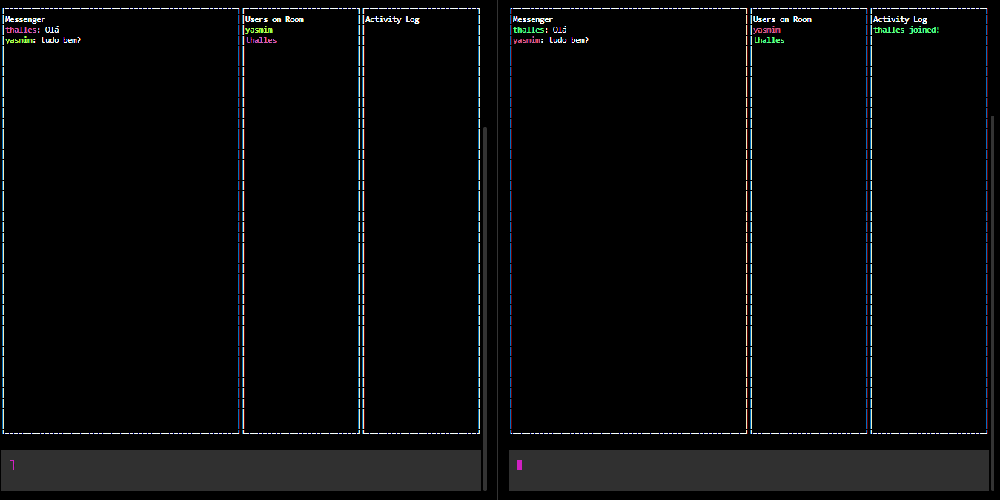

<h1 align="center">
    <br>Hacker Chat<br/>
</h1>


<p align="center">
  <a href="#bookmark">About</a>&nbsp;&nbsp;&nbsp;|&nbsp;&nbsp;&nbsp;
  <a href="#rocket">Technologies</a>&nbsp;&nbsp;&nbsp;|&nbsp;&nbsp;&nbsp;
  <a href="#boom">How to Run</a>&nbsp;&nbsp;&nbsp;
</p>

<p align="center">
  
<p>

## :bookmark: About

Hacker Chat is a cross-platform chat built using command line.

## :rocket: Technologies

-  [Node.js](https://nodejs.org/en/)
-  [Blessed](https://www.npmjs.com/package/blessed)

## :boom: How to Run

- ### **Prerequisites**

 - It is **necessary** to have **[Node.js](https://nodejs.org/en/)** installed on your computer
 - It is **necessary** to have **[Git](https://git-scm.com/)** installed and configured on the computer
 - Also, you **must** have a package manager like **[NPM](https://www.npmjs.com/)**.

1. Make a clone of the repository:

```sh
  $ git clone https://github.com/thallesyasmim/Hacker-Chat.git
```

2. Running the Application:

```sh
  # Server
  $ cd server
  # Installing project dependencies.
  $ npm install 
  # Start the server
  $ npm run dev 

  # Client
  $ cd client
  # Installing project dependencies.
  $ npm install # ou yarn 
  # Start the client
  $ npm run user01 
```

<h2>📱 My social networks:</h2>

<p align="center">
   <a href="https://bit.ly/thalles-github" target="_blank" >
    </a>
    
      
  <a href="https://bit.ly/thalles-facebook" target="_blank" >
    </a>
    
    
  <a href="mailto:ithallesgabriel1307@gmail.com" target="_blank" >
    </a> 
  
  <a href="https://bit.ly/thalles-whatsapp" target="_blank" >
    </a>
 </p>


<h4 align="center">Made with ❤ by Thalles Gabriel 🔥</h4>
